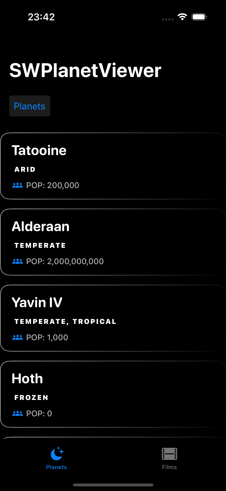

# SWPlanetViewer


[](https://codecov.io/gh/leovido/Planet-Viewer-Portfolio)

A SwiftUI application that allows users to browse planets from the Star Wars universe. 

The app demonstrates modern iOS development practices including MVVM architecture, SwiftUI, Combine, and modular design.

<p>


</p>


## Features

- Browse planets from the Star Wars universe
- View detailed information about each planet
- Tab-based navigation between main sections
- Dark mode space-themed UI

## Architecture & Technical Details

### MVVM Architecture

The application follows the Model-View-ViewModel (MVVM) architecture pattern:

- **Models**: Data structures representing Star Wars planets
- **Views**: SwiftUI views for displaying the UI
- **ViewModels**: Managing business logic, data transformation, and state

### Key Technical Implementations

- **Swift Package Manager**: Core domain logic is isolated in a separate `StarWarsFeature` package
- **Combine Framework**: Used for reactive programming with publishers and subscribers
- **Async/Await**: Modern Swift concurrency for asynchronous network requests
- **Error Handling**: Comprehensive error handling throughout the application
- **Task Management**: Proper cancellation of in-flight network requests
- **SwiftLint**: Integrated for consistent code style and quality

## Design Patterns & Best Practices

- **Action Pattern**: ViewModels receive actions through Combine publishers
- **Protocol-Oriented Design**: Services and providers are defined by protocols for testability
- **Dependency Injection**: Dependencies are injected for better testing and flexibility
- **Separation of Concerns**: Clear boundaries between UI, business logic, and data access
- **Modular Architecture**: Core domain logic is isolated in a separate package

## Data Flow

1. Views send actions to ViewModels through the action publisher
2. ViewModels process actions and update their published properties
3. Views react to published property changes and update the UI
4. API requests are made through service protocols, allowing for easy mocking in tests

## API Integration

The app integrates with the [SWAPI](https://swapi.dev/) (Star Wars API) to fetch planet and character data. The API integration is handled through:

- Protocol-based service definitions
- Async/await for asynchronous network requests
- Codable for JSON parsing
- Proper error handling and response validation

## Requirements

- iOS 17.0+
- Xcode 16.0+
- Swift 6

## Installation

1. Clone the repository
   ```bash
   git clone https://github.com/leovido/SWPlanetViewer.git
   ```

2. Open the project in Xcode
   ```bash
   open SWPlanetViewer.xcworkshop
   ```

3. Build and run the application

## Future Enhancements

- Implement search functionality for planets and characters
- Add favorites feature
- Implement infinite scrolling for large datasets
- Theme switching
- Enhance UI with animations and transitions
- More!

## License

This project is available under the MIT License. See the LICENSE file for more info.
